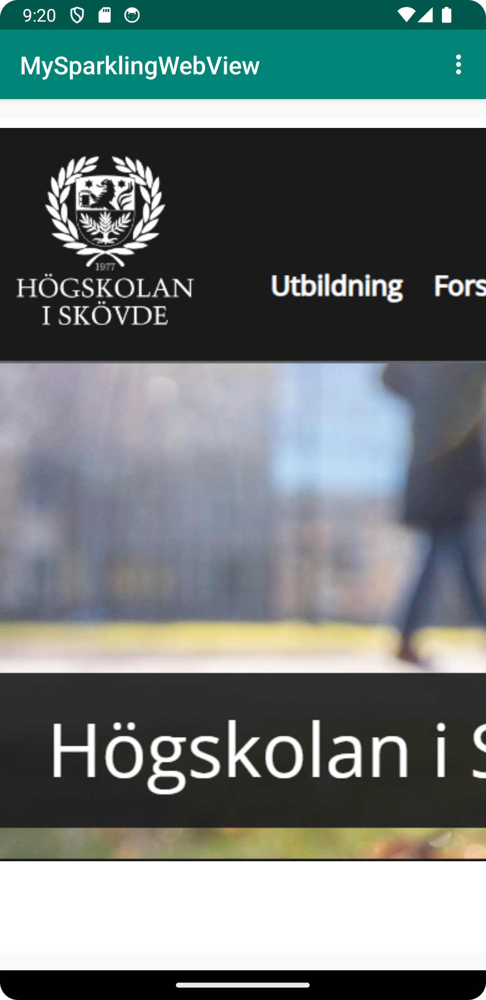
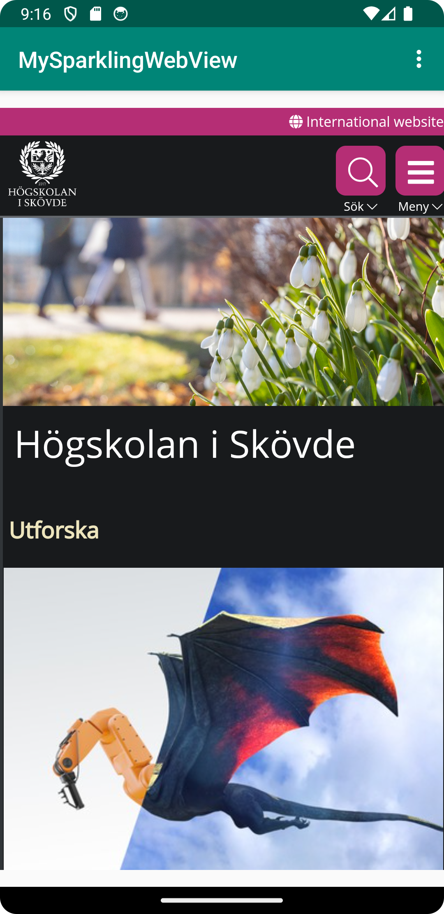

# Rapport
Bytt namn på appen till "MySparklingWebView" (strings.xml), möjliggjort att appen har tillgång 
till internet (AndoridManifest.xml) och har ersättit "TextView" med en WebView element med ID = my_webview (activity_main.xml).

I filen "MainActivity.java" har det skapats en privat variabel "myWebView" av typen WebView och har även möjligjort att WebView elementet i appen får tillgång till
den interna och externa webbsidan "https://www.his.se/".

Aktiverat exekvering av javascript (MainActivity.java) och implementerat så att det går att öppna webbsidan internt och externt
med val av alternativ i en meny(MainActivity.java) samt har lagt till en html fil vid namn "webview.html" som asset 

Koden nedanför möjliggör att webbsidan går att exekveras i appen.
```
 @Override
 protected void onCreate(Bundle savedInstanceState) {
        super.onCreate(savedInstanceState);
        setContentView(R.layout.activity_main);
        Toolbar toolbar = findViewById(R.id.toolbar);
        setSupportActionBar(toolbar);

        myWebView = findViewById(R.id.my_webview);
        myWebView.setWebViewClient(new WebViewClient());
        WebSettings webSettings = myWebView.getSettings();
        webSettings.setJavaScriptEnabled(true);
}
```
Skärmbild på den interna webbsian:

Skärmbild på den externa webbsian:


